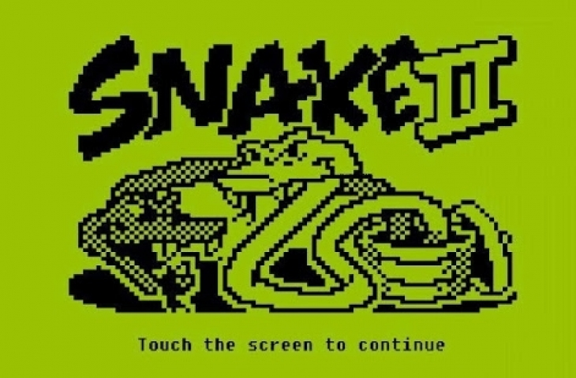

# Snake Game 

> Tribute to the iconic game Snake II of the Nokia 1100 cell phone



## Technology Stack
<div class="container" align="center">
  
  
  
</div>

## Project Structure

```

┌── food.js
├── index.html
├── principal.js
├── README.md
├── snake.js
├── tail.js
└── assets
	├── images
        ├── intro.png
		└── snake.png
	├── js
        ├── p5.min.js
		└── p5.sound.min.js
	└── sound
		├── eat.mp3
		└── game_over.mp3

```
## Test the game
>  Try the game in: <br> https://julianflancheros.github.io/snake-game/

## References
All references that I was use, saw and found arround this topic:

| Details game  | video code and explications  | Code |
| ------------------------ | :----------------------------------------------------------- | :----------------------------------------------------------- |
|  [Option 1](https://youtu.be/yRB3XkAhvAY) | [version code 1](https://youtu.be/Urk4Yf1doQI) | [Editor 1](https://editor.p5js.org/Jeff-Aporta/sketches/Fn_HpD4eg)
[Option 2](https://youtu.be/yRB3XkAhvAY) |  [version code 2](https://www.youtube.com/watch?v=GbPAYZ7tXUY) | [Editor 2](https://editor.p5js.org/codingtrain/sketches/HkDVpSvDm)
[Option 3](https://www.youtube.com/watch?v=gPH2j8ntSN8&t) | [version code 3](https://youtu.be/yUO2bWfBgN8)|
[Option 4](https://www.youtube.com/watch?v=KcpRyIFU7Eg) | [version code 4](https://youtu.be/wgSjVMmkLC0) |
|                   | [version code 5](https://www.youtube.com/watch?v=MMATv1xJw6o&t) |
|                   | [version code 6](https://youtu.be/rui2tRRVtc0) |
|                   | [version code 7](https://youtu.be/QTcIXok9wNY) |
|             | [version code 8](https://youtu.be/TAmYp4jKWoM) |


